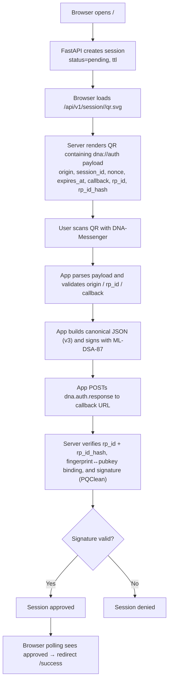

# QR Authentication Protocol

**Last Updated:** 2026-01-14  
**Version:** v3 (current) | v2, v1 (legacy)  
**Implementation:** `dna_messenger_flutter/lib/services/qr_auth_service.dart`

---

## Overview

DNA Messenger supports QR-based authentication allowing external services to authenticate users via their DNA identity. The app acts as an authenticator (conceptually similar to WebAuthn/FIDO2) where:

1. A service displays a QR code with an authentication challenge
2. The user scans the QR with DNA Messenger
3. The app signs the challenge with the user’s ML-DSA (Dilithium-class) key
4. The app sends a signed response to the service callback URL
5. The service verifies the signature and authenticates the user

**Security Properties:**
- Post-quantum signatures (ML-DSA-87 / Dilithium-class)
- HTTPS-only callbacks
- RP (Relying Party) binding prevents phishing (v2+)
- Challenge/nonce prevents replay attacks
- Expiration timestamps prevent stale requests
- Optional tamper-evident audit logging (hash-chained)

---

## How it works (high level)

This server implements a device-mediated, post-quantum authentication flow using QR codes and **native PQClean signature verification**.

A browser session is authenticated only after a mobile device cryptographically approves it. No passwords, cookies, or shared secrets are used.

### Flowchart

Protocol Versions
Version	Features	Status
v1	Basic signing (origin, session, nonce)	Legacy
v2	+ RP binding (rp_id validation)	Supported
v3	+ rp_id_hash in signed payload	Current

Version Selection:

QR payload specifies version via v field

App enforces version-specific requirements

Response echoes the effective version used

QR Payload Formats
JSON Format (Preferred)
{
  "type": "dna.auth.request",
  "v": 3,
  "app": "Example Service",
  "origin": "https://example.com",
  "rp_id": "example.com",
  "rp_name": "Example Inc.",
  "rp_id_hash": "n4bQgYhMfWWaL28...",
  "session_id": "abc123xyz",
  "nonce": "random-challenge-string",
  "expires_at": 1705276800,
  "scopes": ["login", "profile"],
  "callback": "https://example.com/auth/callback"
}

URI Format (Compact)
dna://auth?v=3&app=Example+Service&origin=https://example.com&rp_id=example.com&rp_id_hash=n4bQgYhMfWWaL28...&session_id=abc123xyz&nonce=random-challenge&expires_at=1705276800&callback=https://example.com/auth/callback

Field Reference
Field	Required	Version	Description
type	No	All	"dna.auth.request", "auth", or "login"
v	No	All	Protocol version (1, 2, or 3). Default: 1
app	No	All	Human-readable application name
origin	Yes	All	Service origin URL (e.g. https://example.com)
rp_id	Yes	v2+	Relying Party ID (domain, e.g. example.com)
rp_name	No	v2+	Human-readable RP name
rp_id_hash	Yes	v3	base64(SHA-256(rp_id))
session_id	Yes	All	Server-generated session identifier
nonce	Yes	All	Server-generated challenge
expires_at	No	All	Unix timestamp for expiration
scopes	No	All	Requested permissions
callback	Yes	All	HTTPS URL for response delivery

Field Aliases (compatibility):

origin: domain, service
session_id: sessionId, session
nonce: challenge
expires_at: expiresAt, expires
callback: callback_url, callbackUrl
rp_id: rpId
rp_id_hash: rpIdHash

RP Binding (v2+)

Purpose:
Prevents phishing by ensuring the QR, callback, and origin all belong to the same relying party.

Validation Rules
rp_id required (v2+)
rp_id_hash required (v3)
Origin host must match or be subdomain of rp_id
Callback host must match or be subdomain of rp_id
HTTPS-only callbacks

Host Matching Algorithm
hostMatchesRp(host, rpId):
  if host == rpId: return true
  if host.endsWith("." + rpId): return true
  return false

Canonical Signing
Rules
Keys in strict alphabetical order
No whitespace
UTF-8 encoding
Byte-for-byte identical between app and server
Canonical Payloads

v3 example:
{"expires_at":1705276800,"issued_at":1705276700,"nonce":"challenge","origin":"https://example.com","rp_id":"example.com","rp_id_hash":"o3mm9u6vuZpeN4x...","session_id":"abc123"}

Response Format
{
  "type": "dna.auth.response",
  "v": 3,
  "session_id": "abc123",
  "fingerprint": "128-hex-fingerprint",
  "pubkey_b64": "base64-public-key",
  "signature": "base64-signature",
  "signed_payload": { "...canonical fields..." }
}

Audit Log Verification (Tamper-Evidence)

If audit chaining is enabled (prev_hash + hash per entry and a .state file), logs can be verified offline:
python3 verify_audit.py audit/signature_audit.jsonl --state audit/signature_audit.state

Strict verification (recommended):
python3 verify_audit.py audit/signature_audit.jsonl \
  --state audit/signature_audit.state \
  --strict-chain \
  --strict-bytes

Notes:
Logs without both prev_hash and hash are not fully chained.
The .state file is meaningful only for chained logs.

🔐 Server Signing Key (Required for v4 / Stateless Mode)

DNA-QR-Auth uses a server-side Ed25519 signing key to issue and verify stateless session (st) and approval (at) tokens.

This key:

is generated once by the server operator
never leaves the server
is not a user identity
enables stateless / CDN-scale verification

1️⃣ Generate the server key (once)

Run this on the machine where you deploy the server:

python3 - <<'PY'
import base64
from cryptography.hazmat.primitives.asymmetric.ed25519 import Ed25519PrivateKey
from cryptography.hazmat.primitives import serialization

sk = Ed25519PrivateKey.generate()

raw = sk.private_bytes(
    encoding=serialization.Encoding.Raw,
    format=serialization.PrivateFormat.Raw,
    encryption_algorithm=serialization.NoEncryption(),
)

print(base64.b64encode(raw).decode("ascii"))
PY
Example output:
+Y8K16fqD+UQpt51ZUOvfMlihjkA151Arb6riD7IxlW=

Save this key into .env file so docker-compose.yml loads it
SERVER_ED25519_SK_B64=+Y8K16fqD+UQpt51ZUOvfMlihjkA151Arb6riD7IxlW=

Security Considerations

Downgrade prevention via version-specific requirements
Replay prevention via nonce + expiration
Phishing mitigation via RP binding
Private keys never leave device
ML-DSA (Dilithium-class) targets NIST security level 5

Changelog
Version	Date	Changes
v3	2026-01-14	Added rp_id_hash, audit verification tooling
v2	2026-01-13	Added RP binding
v1	2026-01-12	Initial implementation

