DNA QR Authentication Server

Last Updated: 2026-01-15
Supported Protocols: v4 (stateless), v3 (stateful)
License: Apache-2.0

This repository implements the DNA QR Authentication Server, a device-mediated, post-quantum authentication system using QR codes and native PQClean signature verification.

It is designed to authenticate browser sessions without passwords, cookies, or shared secrets, using a trusted mobile device (DNA-Messenger) as the cryptographic authority.

✨ Key Features
📱 Device-mediated authentication via QR codes
🔐 Post-quantum signatures (ML-DSA-87 / Dilithium-class)
🧬 DNA identity (fingerprint ↔ public key binding)
🧾 Optional tamper-evident audit logging (hash-chained)
🌍 HTTPS-only, phishing-resistant RP binding
🚀 Stateless v4 mode (CDN / Cloudflare-friendly)
🔄 Full backward compatibility with v3

Protocol Versions (Quick Overview)
Version	Mode	Description	Status
v1	Stateful	Basic signing (origin, nonce)	Legacy
v2	Stateful	+ RP binding (rp_id)	Supported
v3	Stateful	+ rp_id_hash in signed payload	Stable
v4	Stateless	Server-signed tokens (st / at), no session storage	Recommended

### Flowchart

```mermaid
flowchart TD
  A[Browser opens /] --> B[Server creates session]
  B --> C[QR with session_id + nonce]
  C --> D[User scans QR]
  D --> E[Phone signs canonical payload]
  E --> F[POST to callback]
  F --> G[Server verifies + stores result]
  G --> H[Browser polls → redirect /success]
```

Authentication Modes (Configuration)
The server supports three modes, controlled via environment variable:

AUTH_MODE=auto   # auto | v3 | v4

Mode	Behavior
v3	Only stateful v3 endpoints enabled
v4	Only stateless v4 endpoints enabled
auto	v4 preferred, v3 fallback

docker-compose.yml (Important Changes)
Minimal required environment
services:
  app:
    environment:
      AUTH_MODE: v4 (or v3 / auto)
      ORIGIN: https://example.trycloudflare.com
      RP_ID: example.trycloudflare.com
      RP_NAME: CPUNK
      SESSION_TTL_SECONDS: 120

      # Required for v4
      SERVER_ED25519_SK_B64: <BASE64_32B_PRIVATE_KEY>

⚠️ If SERVER_ED25519_SK_B64 is missing and AUTH_MODE=v4, the server will fail to start.

🔐 Server Signing Key (Required for v4)
v4 introduces server-signed stateless tokens:
st — session token (QR)
at — approval token
These are signed using a server-only Ed25519 key.

Generate the key (once)

python3 - <<'PY'
import base64
from cryptography.hazmat.primitives.asymmetric.ed25519 import Ed25519PrivateKey
from cryptography.hazmat.primitives import serialization

sk = Ed25519PrivateKey.generate()
raw = sk.private_bytes(
    encoding=serialization.Encoding.Raw,
    format=serialization.PrivateFormat.Raw,
    encryption_algorithm=serialization.NoEncryption(),
)
print(base64.b64encode(raw).decode("ascii"))
PY

Save to .env
SERVER_ED25519_SK_B64=+Y8K16fqD+UQpt51ZUOvfMlihjkA151Arb6riD7IxlW=

Security notes
This key is not a user identity
It never leaves the server
Rotating it invalidates active v4 sessions (expected)

Canonical Signing Rules
All signed payloads (v3 & v4) must be:
UTF-8 encoded
No whitespace
Alphabetically sorted keys
Byte-for-byte identical on phone and server

v3 Canonical Example
{"expires_at":1705276800,"issued_at":1705276700,"nonce":"challenge","origin":"https://example.com","rp_id":"example.com","rp_id_hash":"o3mm9u6vuZpeN4x...","session_id":"abc123"}

v4 Canonical (Phone → Server)
Includes binding to st:
{"expires_at":1705276800,"issued_at":1705276700,"nonce":"challenge","origin":"https://example.com","rp_id_hash":"...","session_id":"abc123","sid":"abc123","st_hash":"..."}

Identity Allowlist (v3 & v4)
Both protocols use the same allowlist mechanism:
known_identities.json
Verified via fingerprint ↔ public key
Enforced server-side

Audit Logging (v3 & v4)
All security-relevant events are logged via the same audit system:
Hash-chained (prev_hash → hash)
Optional .state file
Verifiable offline

python3 verify_audit.py audit/signature_audit.jsonl \
  --state audit/signature_audit.state \
  --strict-chain \
  --strict-bytes

v4 logs include:
st issuance
v4 verification result
approval token (at) issuance

Security Properties
✅ Post-quantum cryptography (NIST level 5)
✅ Replay protection (nonce + expiry)
✅ Downgrade prevention (version enforcement)
✅ RP binding (origin / rp_id / rp_id_hash)
✅ No shared secrets
✅ No browser-stored credentials

Changelog
Version	Date	Notes
v4	2026-01-15	Stateless tokens, CDN-scale auth
v3	2026-01-14	rp_id_hash, audit verification
v2	2026-01-13	RP binding
v1	2026-01-12	Initial QR auth

License

This project is licensed under the Apache License 2.0.

See the LICENSE file for details.

